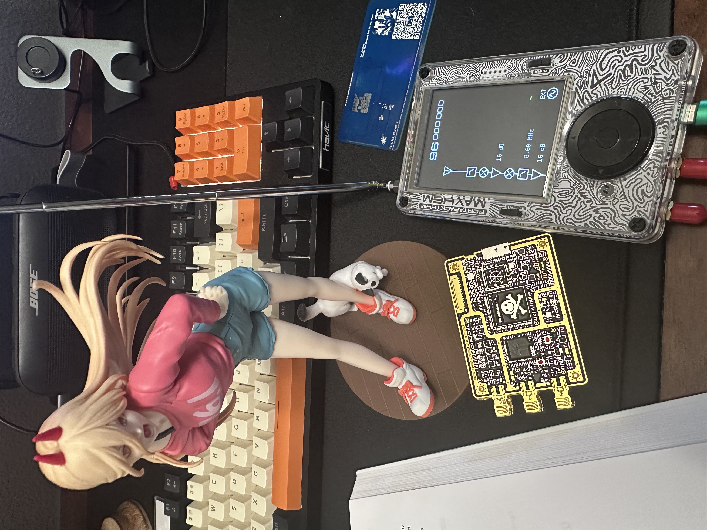

# HackRF SDR Learning & Experimentation

## Overview
This repository documents my journey learning Software Defined Radio (SDR) and RF fundamentals using the HackRF One. Following the excellent "Practical SDR" book by David Clark and Paul Clark, I've created various GNU Radio flowgraphs to receive and transmit radio signals.

## GNU Radio Flowgraphs
- FM Reception: Flowgraphs demonstrating FM demodulation and audio output
- AM Reception: AM signal reception and demodulation
- FM Transmission: Legal low-power FM transmission to local receivers (within FCC limits)
- Signal Analysis: Various blocks for visualizing and analyzing RF signals

## Documentation
Each flowgraph includes:
- Block diagram screenshots
- Configuration parameters
- Frequency ranges used
- Lessons learned and troubleshooting notes

## Hardware Used
- HackRF One: Primary SDR transceiver
- Antennas: ANT500
- Audio Equipment: Speakers/headphones for demodulated audio output

## Learning Resources
- Primary Reference: "Practical SDR" by David Clark and Paul Clark
- GNU Radio documentation
- HackRF community resources

## Legal Note
All transmissions documented in this repository comply with FCC regulations for unlicensed operation. FM transmission experiments were conducted entirely in software using GNU Radio flowgraphs (Signal Source block to Audio Sink block) without actual RF transmission via hardware.

## Project Goals
- Understand fundamental RF concepts (modulation, demodulation, filtering)
- Gain practical experience with GNU Radio Companion
- Learn signal processing techniques
- Experiment with different modulation schemes
- Build a foundation for more advanced SDR projects

## Additional SDR Experiments Completed/Inprogress
- Car Key Fob Replay: Capture and analysis of remote keyless entry signals
- ADS-B Aircraft Tracking: Recieve and track commercial aircraft ADS-B data
- Signal Analysis: Exploration of signals in the MF, HF, VHF and UHF frequency bands

## Screenshots
Flowgraph examples and spectrum analyzer outputs are included in the respective project folders.

*Note: Video demonstrations of FM reception are available but not included in this repository due to file size constraints. Contact me if you'd like access to supplementary materials.*
